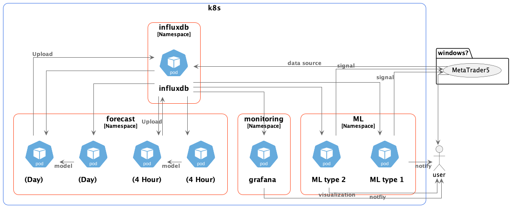

# ボツネタ　残骸

# 機械学習のためのインフラを構築するリポジトリ

下記をk8sマイクロサービスとして展開可能にすることを主眼とする

- mt5からのinfluxdbへのデータ蓄積
- greykite等を用いた時系列予測
- 強化学習によるEA

バックエンドのデーターベースにはinfluxdbを使用

grafanaで可視化を行う

## ねらい

時系列予測や、強化学習を行うpodはhelmでひな形を作りデプロイし、複数（時間足・銘柄）を並行的に扱えるようにする。

関連するすべてをhelmでデプロイし、スクラップアンドビルドを容易に、複数のデータ系統を処理しやすくする。

## mt5

Windowsか、wineで実行する。

そのため、使用するリソースが多くなることが予測される。

そのため、アップロードアプリで複数系統をスレッド実行する方向で開発を進める

一応機能はしているが微調整が必要。

influxdbラッパにtag指定するクエリが必要

## 予測

モデル作成パートと、予測パートを分ける。　←　greykiteだとあまり意味ないかも？

狙いとして、煩雑化をさけ、モデル管理を他所に移管するコトを考慮

使用するリソースや、定期的な実行が必要な点も考慮

silverkite、gluonts、timesNetあたりで、存在するモデル・ライブラリを使用する予定

予測のクソさはおいておいて、外枠を固める

至急code, dockerfile, helmを用意

influxdbタグとk８のリソース管理のための規則が必要

tick,barどちらにも対応する必要がある。

扱いづらいので、

予測はpd.serise単位での管理としてひとまず作成

**命名規則**

### model作成パート

influxdbのデータから、逐次適当な通過枠・時間枠ごとにモデル作成を行う

### 予測パート

モデル作成パートで作成したモデルをもとに、将来値を予測。

予測データをinfludbに書き込む

timeframe 未来？

## 強化学習

諸々確認中…

ポリシーの管理・配布をどうしようか…

モデル、プラットフォームは何を使うのか？、どういった可能性があるのか？

## 可視化

ひとまず、grafanaに接続可

データソースとして追加する。（データソース・ダッシュボードともにヘルムで指定可能）

しかし、クエリビルダーなどはなく、fluxクエリをいちから手書きする必要がある。

データーは通常通り、grafana上のグラフとして描写できる。
