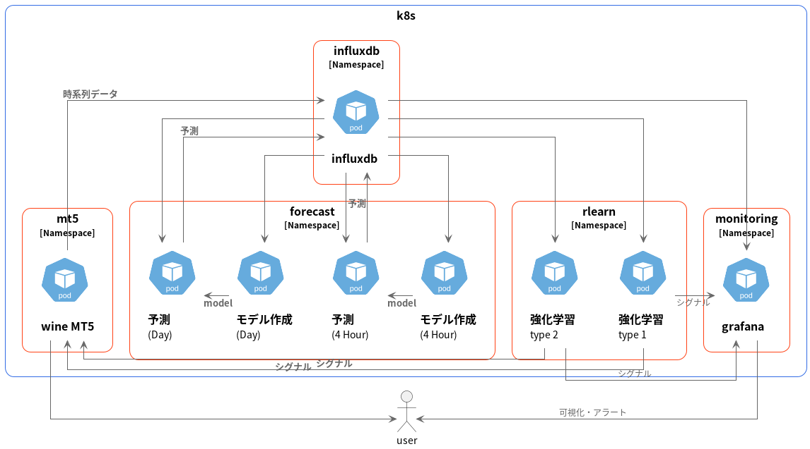

# 機械学習のためのインフラを構築するリポジトリ

下記をk8sマイクロサービスとして展開可能にすることを主眼とする

- mt5からのinfluxdbへのデータ蓄積
- greykite等を用いた時系列予測
- 強化学習によるEA

バックエンドのデーターベースにはinfluxdbを使用

grafanaで可視化を行う

## ねらい

時系列予測や、強化学習を行うpodはhelmでひな形を作りデプロイし、複数（時間足・銘柄）を並行的に扱えるようにする。

関連するすべてをhelmでデプロイし、スクラップアンドビルドを容易に、複数のデータ系統を処理しやすくする。

## mt5

Windowsか、wineで実行する。

そのため、使用するリソースが多くなることが予測される。

そのため、アップロードアプリで複数系統をスレッド実行する方向で開発を進める

一応機能はしているが微調整が必要。

influxdbラッパにtag指定するクエリが必要

## 予測

モデル作成パートと、予測パートを分ける。

狙いとして、煩雑化をさけ、モデル管理を他所に移管するコトを考慮

使用するリソースや、定期的な実行が必要な点も考慮

silverkite、gluonts、timesNetあたりで、存在するモデル・ライブラリを使用する予定

## 強化学習

諸々確認中…

ポリシーの管理・配布をどうしようか…

モデル、プラットフォームは何を使うのか？、どういった可能性があるのか？
